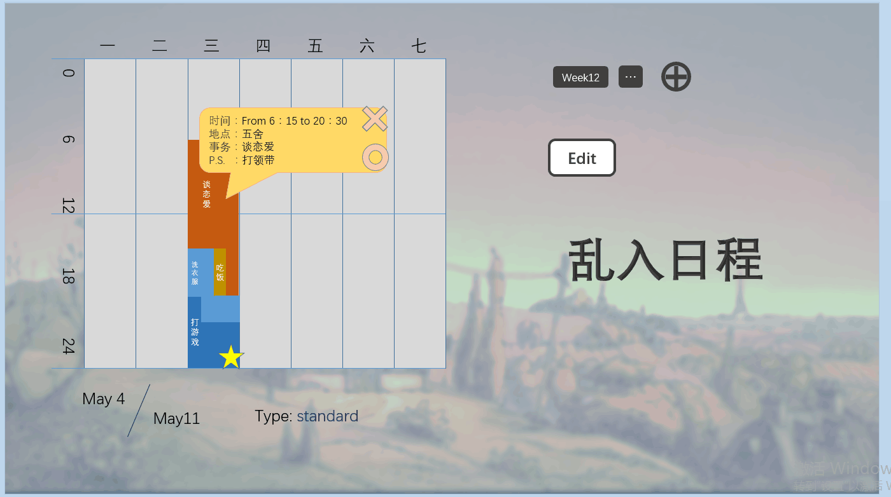

# Parallel Diary

  

  

# 产品创意
>在设计之初，我们的目的是开发一款可以协调不同种类工作进行的计划安排周历，我们希望使用者能够合理地将不同种类的工作穿插进行来得到休息，提高效率。日历日程表等应用已经有很多可以参考的案例，日历甚至是注册时填写生日的常用工具，日程表早已成为系统应用。

>因此我们在设计的时候希望它能把日常工作与特殊事务相结合，一部分事务是已经预设过的，而另外的一些则是临时性的，我们希望通过它，人们在生活得井井有条的同时也能够回味新鲜的生活。

>在最初的设计阶段我曾对这款周历的样式进行过多次想象，最初它是并行的时间线安排，后来我想做为学术的日常，底层可以放一张课程表。但课程表的想法慢慢淡化了，因为它只是一张一成不变的图，相应的也不会让人为此额外操心。 

## 创意
> 我希望它有五线谱的样子，希望事件能练成绳索，希望它可以像剪辑软件或者混音软件一样操作。但实际在技术上，我找到的符合预想的组件全都不能正常工作。这一直让我很痛苦，因为我研究了很久像是material-slider这些组件的用法，我希望能用优美的圆点来代替拖拽整个方块。  

## 需求
>这个设计给我最大的鼓励是，身边的朋友看到了原型图样表示想用。
但另一方面给我很大打击的是我看见了谷歌日历，和我最初的设计方案有很多相似之处，例如事件的并行交叉，时间按格划分。我不能重新发明轮子，所以我放弃了对div的研究转向使用canvas绘制图样。
>我希望它和甘特图有一点功能上的近似之处，但强调的是每一周的计划轮回，并且学习过数据库后设置一些存档是很容易的事情，这样我们可以建设性地制作表格。     

## 设计的功能列表以及其完成情况

 设计的功能|承担该功能的组员|任务完成度
 --|--|--
  ①前端交互的开发：增加、修改和删除List中的数据，事件分类；②相关数据结构，类和架构|赵世宇|基本完成，稳定使用，界面布局和操作手感有待改进
  ①提供多种默认安排|赵世宇|目前仅从数据库中读取得到一种
  ①数据库增删查改②服务器|朱子恒|可本机运行，数据库网络连接存在问题，服务器尚未实现

# 产品技术方案
> 主要使用web-angular框架，底层diary使用静态对象给各部分数据更新提供接口；在数据库中读取List数据后异步传递给静态对象，服务器尚未搭建成型。前端主要由包含日程安排总览的canvas和使用angular-component搭建的UI组成，canvas的功能是调整事件分布，时间长度，分类显示。canvas使用stagexl提供用户操作的接口函数。UI包括控制删除修改和增加一条记录，列表选择，改变事件归类类型。为了引入一部分样式也就是sass1.15而把dart-sdk升级到了2.1版本，但最后并没机会用上。
>可能是使用的技术工具难度的问题，开发调试的过程比想象中要顺利一些，但出现了一些重复的工作。最大的技术难题一开始是换了一种语言语法不通，但看过几次其他人的代码基本上就都能看懂，但最大的问题仍然是没有写过html，解决问题的思路狭窄受限。后期最大的问题是需要提供鼠标在某一个元素上的相对位置，使用stagexl一定程度上解决了示例不足的问题，因为很多例子可以直接在网页运行不必重新调整本机环境。
>总的来说package还算是一个比较好用的工具，虽然相比于API可以直接搜到，package主要可以提供源码参考。但也因为非常想用别人的源码而停滞了很久。
> 技术上比较复杂的地方是语句执行的顺序问题，因为类有多个而一步操作可能会涉及到多个类型的变量同时进行调整，且使用的Map等数据结构使一些变量联系比较密切，想要做为一个读取然后照样继续完成增删改会出现各种NoSuchMethod的问题。

# 我在小组中的分工
>我感觉两个人都为团队项目提供了意见，做出了自己的贡献，并且协调好了工作。但在寻找资源提出解决方案的时候希望对方的态度能开放和积极一些，因为踢倒旧房子是容易的，但只有木匠才能把新房子盖好。
  
   组员|分数
 --|--
  赵世宇|7
  朱子恒|6

# 我的编程实践活动
## 我的代码
>一开始找了一个简陋的框架，后来看了很多源码都用不上，只能自己写。
  
```dart
///数据接口
class BackendService {
//假数据库
  static final _mockEvents = [
    Events('coding','i like coding',2,18,36,"game"),
    Events('sleep', 'i hate sleep',3,6,24,"rest"),
    Events('learn', 'Learning makes me happy!',4,8,32,"learn"),
  ];

  var conn;
  List<Events>events;

    Future<List<Events>> transform() async {
      var data = await TraverseAllData(conn);
      for(EventData ed in data){
        Events newE=new Events(ed.name, ed.description, (ed.startTime.hour/24).floor(),
            (ed.startTime.hour%24)*4+(ed.startTime.minute/15).floor(),
            ((ed.finishTime.hour-ed.startTime.hour)*4).floor()+((ed.finishTime.minute-ed.startTime.minute)/15).floor(),
            ed.type);
        events.add(newE);
      }
      return events;
    }


  Future<List<Events>> getAll(type) async {
      //TraverseAllData(conn);

      //return transform();
    return _mockEvents;
  }
}

class EventService{
  final BackendService _backendService;
  List<Events>events;

  EventService(this._backendService);
  Future<List<Events>> getAll() async {
    events = await _backendService.getAll(Events);
    return events;
  }
}

///画canvas的类和定义用户操作函数，有点像C#
class eventBar extends DisplayObjectContainer {
  Map<String, int> _colors={"learn":Color.Gray,"game":Color.Yellow,"rest":Color.Blue,"meal":Color.Pink};
  Map<String, int> col={"learn":1,"game":2,"rest":3,"meal":4};
  int _colorIndex = 0;
  TextField _textField;
  static const int h=60;
  static eventBar selector;
  static double tempMouseX,tempBarX;
  Events myevent;
  static int mouseKey;


  eventBar(Events event) {
    print(event.name);
    myevent=event;
    _colorIndex=_colors[event.type];
    _textField = new TextField();
    _textField.defaultTextFormat = new TextFormat("Verdana", 14, Color.Black);
    _textField.width = event.width;
    _textField.height = h;
    _textField.alpha=0.7;
    _textField.x=event.x;
    _textField.y=col[event.type]*80;
    _textField.background = true;
    _textField.backgroundColor = _colorIndex;
    _textField.text = event.name;
    addChild(_textField);

    this.onEnterFrame.listen(_onEnterFrame);
    this.onMouseClick.listen(_onMouseClick);
    this.onMouseDown.listen(_onMouseDown);
    this.onMouseUp.listen(_onMouseUp);
    this.onKeyDown.listen(_anyKeyDown);
    this.onMouseMove.listen(_onMouseMove);
    this.onMouseRightDown.listen(_onMouseRightDown);
    this.onMouseRightUp.listen(_onMouseRightUp);

  }

  _anyKeyDown(KeyboardEvent){
    _textField.text = myevent.name;
  }

  _onEnterFrame(EnterFrameEvent e) {

  }

  _onMouseRightUp(MouseEvent e) {
    selector=null;
    myevent.UpdateEventTime(_textField.x.floor(), _textField.width.floor());
    BaseEventComponent.selectedEvent=myevent;
    mouseKey=0;

  }

  _onMouseRightDown(MouseEvent e) {
    selector=this;
    tempMouseX=mousePosition.x;
    tempBarX=this._textField.width;
    print(selector.name);
    BaseEventComponent.selectedEvent=myevent;
    mouseKey=2;

  }

  _onMouseUp(MouseEvent e){
    selector=null;
    myevent.UpdateEventTime(_textField.x.floor(), _textField.width.floor());
    BaseEventComponent.selectedEvent=myevent;
    mouseKey=0;
  }

  _onMouseClick(MouseEvent e) {

  }

  _onMouseDown(MouseEvent e){
    selector=this;
    tempMouseX=mousePosition.x;
    tempBarX=this._textField.x;
    print(selector.name);
    BaseEventComponent.selectedEvent=myevent;
    mouseKey=1;
  }


  _onMouseMove(MouseEvent e){
    if(selector==this)
      if(mouseKey==1)
    selector._textField.x=tempBarX+mousePosition.x-tempMouseX;
      if(mouseKey==2){
        selector._textField.width=tempBarX+mousePosition.x-tempMouseX;
      }
  }


}

///事件对象
class Events{
  static int _id=1;
  Map<int,String> dayName={0:"Sunday",1:"Monday",2:"Tursday",3:"Wednesday",4:"Thursday",5:"Friday",6:"Saturday"};
  String name,desc,type;
  int begin_date,begin_time,lasting_time,my_id;
  Events(this.name,this.desc,this.begin_date,this.begin_time,this.lasting_time,this.type){_id++;this.my_id=_id;}

  int get x=>begin_date*96+begin_time;
  int get width => lasting_time;
  String get begin_string => (this.begin_time~/4).toString()+":"+((this.lasting_time%4==0)?"00":(this.lasting_time%4*15).toString());
  String get lasting_string => (this.lasting_time~/4).toString()+":"+((this.lasting_time%4==0)?"00":(this.lasting_time%4*15).toString());

  UpdateEventTime(int x,int width){
    this.begin_date=(x/96).floor();
    this.begin_time=x%96;
    this.lasting_time=width;

  }


}

///主体

class BaseEventComponent implements OnInit {
  static List<Events> events;
  static List<eventBar> eventBars;
  static Map EvToEb=new Map();
  static Events selectedEvent;
  static var canvas=querySelector('#stage');
  static var stage=new Stage(canvas);
  static var renderLoop = new RenderLoop();

  final EventService _eventService;

  BaseEventComponent(this._eventService);

  void ngOnInit() async {
    renderLoop.addStage(stage);
    eventBars=new List<eventBar>();
    events = await _eventService.getAll();
    for(var i=0;i<events.length;i++){
      var eb=new eventBar(events[i]);
      eventBars.add(eb);
      EvToEb[events[i]]=eb;
      stage.addChild(eb);
    }
  }

  static void deleteEvent(Events e){
    stage.removeChild(EvToEb[e]);
    events.remove(e);
    eventBars.remove(EvToEb[e]);
    EvToEb.remove(e);
    selectedEvent=null;
  }
  static void updateType(Events e){
    stage.removeChild(EvToEb[e]);
    eventBars.remove(EvToEb[e]);
    var eb=new eventBar(e);
    eventBars.add(eb);
    EvToEb[e]=eb;
    stage.addChild(EvToEb[e]);
  }

  void addEvent(){
    Events e=new Events("New", "Description", 0, 15, 15, "game");
    events.add(e);
    var eb=new eventBar(e);
    eventBars.add(eb);
    EvToEb[e]=eb;
    stage.addChild(eb);
  }


  void selectEvent(Events event
    //  ,MaterialCheckboxComponent cb
      ) {
    //if(cb.checked){
    //  selectedEvent=null;
  //  }
//      else

    selectedEvent = event;
  }
}

```
  
## 我的活动量化
    

>赵世宇/10164507116

/4 commits / 692 ++ / 339 --/

另有两次的提交为了顺便把包传给队友，就让队友帮我填了。加上html代码量大概在一千五（两天爆肝成果


# 我的自评
>工程不同阶段效率差异很明显，在最初的半个月中对语法和架构不够了解，之后在使用滑块组件上白白耗费了过多精力，虽然加深了理解但对开发没有直接帮助。最终借助Html5开放包中的鼠标点击和拖动事件在工程的最后阶段完成了80%的开发工作，实际过程虽然劳累但并未感到艰难。

> 做了很多无用功，一开始总是想要使用别人成型的工具，但其实一方面这种工具学习改造起来很费事，另一方面也容易造成一定程度上的吃现成饭的心理。另外其实对网页编程的逻辑并不是很熟悉，常常是只有架构而没有细节理解。

> 我感觉再用五六天应该可以把界面做的很完善，把手感上的一些bug消除，新功能其实加起来已经很熟练了，但可能需要重写一部分数据结构。前提如果服务器不归我管。
