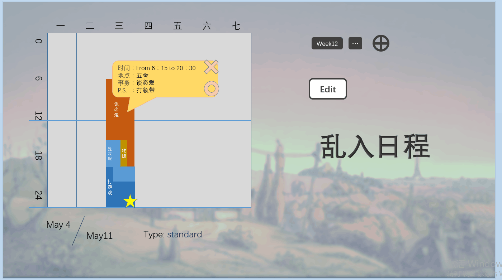

# 产品创意
  

## 创意
> 在产生这个项目的时候，我们思考了什么样的web app可能是我们需要的，日常生活中会用到的。小组成员中的赵世宇提到了他需要一个可以安排日常计划的日程表，这就是我们小组创意的开始。  
>那么，什么样的日程表是我们需要的呢？现在的市面上已经有了很多的日历、日程表类型的app，但是大多功能重复。一方面，我们希望能够将不同的工作安排在日程表中，还能保证相互穿插在一起，更加符合现实的场景，比如，打游戏和洗衣服这两项人物之间可能会有所重叠。此外，我们希望能够创建出计划的模板，能够提供给用户作为参考，来方便用户建立一个新的日程表。   
 
   
>我们选择做成了周程表的形式，并希望所有的事件可以想组建一样自由拖动，事件之间可以相互穿插，从而使用户可以自我来设计这张表，增添事件，也可以在一定程度上调整外观，可以自己创建模板，也可以选择我们已经提供好的模板，而不是像课程表这样死板的形式。
## 需求
> 首先在功能上，它相比于现在比较流行的日历、计划表类型的app而言形式比较新颖，允许事件之间的相互穿插，同时，我们的原型设计也受到了一些人的认可，这说明确实是有需求的。  
>接着在设计方面，模板的提供为用户提供了便利，允许用户对模板的修改也满足了用户的个性化需求。
>在之前的一些课程上，我们班级的学生尝试使用了甘特图来制定学习计划，这收到了一些正面的反馈，因此在设计上增加了类似甘特图的功能，来满足用户的需求。

## 设计的功能列表以及其完成情况

 设计的功能|承担该功能的组员|任务完成度
 --|--|--
  ①前端交互的开发：增加、修改和删除List中的数据，事件分类；②相关数据结构，类和架构|赵世宇|基本完成，稳定使用，界面布局和操作手感有待改进
  ①提供多种默认安排|赵世宇|目前仅从数据库中读取得到一种
  ①数据库增删查改②服务器|朱子恒|可本机运行，数据库网络连接存在问题，服务器尚未实现

# 产品技术方案 
> 我们产品是利用Canvas在网页中创建出一个日历，从数据库中读取出之前保存的所有事件并利用Canvas绘制在日历上，基本框架是利用web-angular的框架。    
> 在客户端界面上，用户通过添加事件的按钮可以创建事件，填写事件的名称、具体描述，选择事件的类型。用户可以在日历山看到自己新添加的事件，并且可以通过拖动事件来调整事件的开始时间和持续时间，这一功能主要利用Canvas和dart中提供的的stagexl包来实现。    
>在服务器端上需要在进入网页的时候就自动调取数据库中已经存储的所有数据，并将数据传到客户端用于绘制画面。之后，服务器端会不断接收从客户端中传来的数据，实现：将新的事件存储到数据库中、删除某个事件、修改并保存某个事件等功能。这个功能计划是在原先作业中实现的serve服务器架构中补充完善，利用dart中提供的sqljocky5包来实现各种数据库操作。主要的内容可以参考dart中sqljocky5中的样例程序。    

# 我在小组中的分工
>我在小组之中主要负责数据库的建立、用dart将写好的事件存储到数据库之中，以及从数据库中导出数据、实现增删查改等功能，原本还需要搭建服务器，但是因为时间关系没能够完成。
>   组员|分数
>   --|--
> 赵世宇|8
> 朱子恒|7

# 我的编程实践活动
## 我的代码
>此部分是我在本次项目中完成的代码
```dart
class Time{
  int hour;
  int minute;

  Time(int hour,int minute){
    this.hour=hour;
    this.minute=minute;
  }
  bool equal(Time another){
    if(this.hour==another.hour && this.minute==another.minute) return true;
    else return false;
  }

  String getTime(){
    String time=this.hour.toString()+":"+this.minute.toString();
    return time;
  }
}

```
```dart
class EventData{
  int id;
  String name;
  Time startTime;
  Time finishTime;
  String description;
  String type;
  
  //初始化
  EventData(String name, String startTime, String finishTime, String description, String type){
    this.name=name;
    this.description=description;
    this.type=type;

    List temp=startTime.split(":");
    this.startTime=new Time(int.parse(temp[0]),int.parse(temp[1]));

    temp=finishTime.split(":");
    this.finishTime=new Time(int.parse(temp[0]),int.parse(temp[1]));

  }

  //直接赋予id
  void setID(int id){
    this.id=id;
  }
  
  //数据库增加事件
  Future<void> InsertDatabase(MySqlConnection conn) async{
  List<int> Items;
  //在数据库中查找已有的所有id
  Results results = await conn.execute('select id from events');
   results.forEach(
     (Row row) {
     Items.add(int.parse('id:${row[0]}'));
     }
   );
   //赋予未使用过的id
   if(Items.length<1000){
      List<int> numList=new List(1001);
      for(int i=1;i<=1000;i++) numList[1]=0;
      for(int i=0;i<Items.length;i++) numList[Items[1]]++;
      for(int i=1;i<1001;i++)
        if(numList[i]==0){
          this.id=i;
          break;
        }
   }
  print("Inserting rows ...");

  //在数据库中增加事件
  List<Results> r1 =
      await conn.preparedMulti("INSERT INTO events (id,name,description,startTime,finishTime,type) VALUES (?,?,?,?,?,?)", 
      [
        [this.id,this.name,this.description,this.startTime.getTime(),this.finishTime.getTime(),this.type]
      ]);
  print("Rows inserted!");
}    
  
//在数据库中删除这一事件
Future<void> DeleteDatabase(MySqlConnection conn) async{
  print("Deleting rows ...");
  List<Results> r1 =
      await conn.preparedMulti("DELETE FROM events (id,name,description,startTime,finishTime,type) WHERE id='?'", 
      [
        [this.id]
      ]);
  print("Rows deleted!");
  }
}
```
```dart
//从数据库中读取所有的事件数据，并返回EvenData列表
  Future<List<EventData>> TraverseAllData() async{
    var s = ConnectionSettings(
      user: "deit2016",
      password: "deit2016@ecnu",
      host: "www.muedu.org",
      port: 3306,
      db: "deit2016db_10164507136",
    );
    print("Opening connection ...");
    var conn = await MySqlConnection.connect(s);
    print("正在从数据库中调取数据。。");
    List<EventData> list;
    EventData temp;

    Results results = await conn.execute('select * from events');
    results.forEach(
            (Row row) {
          //Items.add(int.parse('id:${row[0]}'));
          String time1='startTime:${row[4]}',time2='finishTime:${row[5]}';
          temp=new EventData('name:${row[1]}',time1,time2,'description:${row[3]}','type:${row[6]}');
          temp.setID(int.parse('id:${row[0]}'));
          list.add(temp);
        }
    );

    print("事件读取完毕！");
    return list;
  }
```
## 我的活动量化
> 活动量化数据截止到2017-1-11,23:59.
>    

>  **朱子恒/10164507136/6 commits / 1,051 ++ / 565 --/**  
>PS：有1次commit是我代替赵世宇进行的，因此上述数据并不准确。

# 我的自评 
> 总体来讲，我对我这次项目中完成的工作不是很满意。  
> 首先，我主要完成了数据库的搭建和项目中所有的数据库操作的代码。从功能上来讲，这部分的工作算是实现了，但是，尽管函数在测试的时候是可行的，但是在实际调用的过程中却发现无法与数据库相连（这一问题是在进行webdev serve命令的时候出现的，但是如果直接dart main.dart操作可以正常连接），这个问题对最终成果的完成造成了很大的阻碍。   
>  其次，由于时间因素，服务器的搭建并没有实际落地，这也有可能是实际运行过程中无法连接上数据库的一个原因（猜测），这也就导致了我们的项目完成度不高，很多预期的功能没有实现。  
> 预计如果再利用12个小时以上的时间，可以完成服务器的搭建，数据库连接的问题相对而言应该需要2个小时以上的时间，可能会出现的其他bug的修复需要4个小时，如果想要进一步完善、细化功能的话，达到我们预期的目标的话，需要额外12个小时左右。